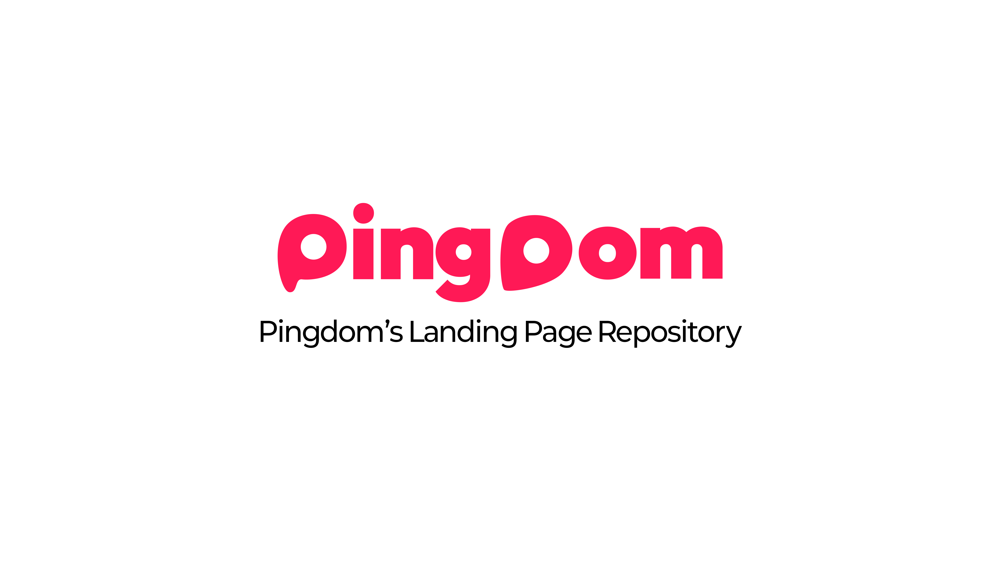

---

## Overview

이 저장소는 Pingdom 프로젝트의 **공식 랜딩페이지**를 관리합니다.

Pingdom은 **한국에서 갈 곳을 더 쉽게** 발견할 수 있도록 방한 여행자와 로컬 경험을 연결하는 위치 기반 서비스입니다.

랜딩페이지는 장소 발견부터 정보 확인, 방문 검증, 예약, 여행 기록까지의 서비스 흐름을 실제 제품 화면과 브랜드 이미지로 소개합니다. 사용자, 상점주, 운영자를 연결하는 플랫폼과 Pingdom AI, Pingdom Consulting, 글로벌 비전을 함께 전달합니다.

공개 페이지: [pingdom-landing.vercel.app](https://pingdom-landing.vercel.app/)

## Project Status

현재 **공개 배포된 정적 웹사이트**를 유지·개선하고 있습니다.

데스크톱과 모바일 화면을 제공하며, 콘텐츠, 자산, 화면 구성 및 스크롤 동작의 변경은 Git 변경 이력과 관련 문서로 관리합니다.

| Item | Status |
| --- | --- |
| Development | `Active Maintenance` |
| Release | `Public Deployment` |
| Delivery | `Static Website / Vercel` |

## Repository Role

| Item | Description |
| --- | --- |
| Type | `Landing Page` |
| Responsibility | Pingdom 서비스 소개, 브랜드 표현, 반응형 화면 및 스크롤 인터랙션 |
| Primary Output | `dist/`의 HTML, CSS, JavaScript 및 정적 자산 |
| Target | Pingdom을 알아보는 여행자, 상점주 및 서비스 관계자 |

## Scope

### Included

- Pingdom의 브랜드 인트로와 서비스 소개 콘텐츠
- 실제 앱 화면을 활용한 장소 탐색, 커뮤니티, 방문 검증, 예약 및 여행 기록 소개
- 서비스 강점 카드, 플랫폼 및 상점주 웹 화면 소개
- Pingdom AI, Pingdom Consulting 및 글로벌 비전의 시각적 소개
- 데스크톱 스크롤 장면, 화면 전환 및 영상 진행도 동기화
- 모바일·태블릿의 세로 콘텐츠 흐름, 가로 카드 탐색 및 제품 화면 확대
- 키보드 탐색, 초점 복귀, 동작 줄이기 설정 및 정적 대체 화면
- 이미지·영상 자산, 관련 검증 스크립트 및 Vercel 정적 배포 설정

### Not Included

- 모바일 앱, 관리자 웹 및 상점주 웹의 실제 서비스 기능 구현
- 사용자 로그인, 예약 접수, 방문 인증 및 여행 기록의 서버 처리
- AI 모델 호출, 추천 알고리즘 및 상권 분석의 서버 측 로직
- 백엔드 API, 데이터베이스 및 운영 인프라 구축

## Key Capabilities

- **Service Story**: 발견 → 확인 → 방문 → 기록의 흐름을 제품 화면과 설명으로 전달합니다.
- **Product Showcase**: 앱 기능과 상점주 웹을 원본 제품 이미지로 소개하고, 모바일에서는 화면을 확대해 볼 수 있습니다.
- **Platform Introduction**: 여행자, 상점주 및 운영자의 역할을 연결된 사진과 콘텐츠로 보여줍니다.
- **AI and Consulting**: 여행 AI와 상권 상담의 역할을 브랜드 그래픽과 소개 문구로 설명합니다.
- **Scroll Interaction**: 데스크톱에서 장면 전환, 읽기 구도의 짧은 정지, 영상 진행도 및 역스크롤 복원을 처리합니다.
- **Responsive Experience**: 모바일에서 별도의 세로 배치, 터치 탐색 및 가로 카드 흐름을 제공합니다.
- **Accessible Navigation**: 본문 바로가기, 앵커 이동, 키보드로 닫을 수 있는 이미지 dialog와 동작 줄이기 설정을 지원합니다.

## Technology and Tools

| Category | Technology |
| --- | --- |
| Primary | HTML5, CSS, JavaScript ES Modules |
| Rendering | DOM, Canvas 2D, WebGL |
| Motion | `requestAnimationFrame`, CSS Transform, 스크롤 진행도 기반 상태 제어 |
| Responsive | CSS Media Queries, 터치·가로 스크롤 인터랙션 |
| Media | PNG, WebP, SVG, MP4, WOFF2 |
| Testing | Node.js 내장 `node:test`, 정적 참조·자산 검증 스크립트 |
| Local Preview | Python 3 HTTP Server |
| Media Authoring | `media-src/seoul-traffic/`의 HyperFrames, GSAP |
| Delivery | Vercel, `dist/` 정적 배포 |

## Getting Started

### Requirements

- Python 3: 로컬 정적 서버 실행
- Node.js: 정적 검사 및 관련 모듈 테스트 실행
- 최신 데스크톱 또는 모바일 브라우저

랜딩페이지 실행에는 패키지 설치나 컴파일 빌드가 필요하지 않습니다. 영상 제작 프로젝트의 의존성은 `media-src/seoul-traffic/`에서 별도로 관리합니다.

### Setup

```bash
git clone https://github.com/Type-Nu11/pingdom-landing.git
cd pingdom-landing
```

### Usage

저장소 루트에서 실행합니다.

```bash
python3 -m http.server 4173 --bind 127.0.0.1 --directory dist
```

브라우저에서 [http://localhost:4173](http://localhost:4173)을 엽니다.

### Configuration

랜딩페이지를 실행하기 위한 API Key나 환경변수는 필요하지 않습니다.

`vercel.json`은 `dist/`를 배포 디렉터리로 지정하며, 별도의 framework, install 또는 build 단계 없이 정적 파일을 제공합니다. `.vercelignore`는 배포 대상을 `dist/`와 `vercel.json`으로 제한합니다.

로컬 환경변수, Vercel 프로젝트 연결 정보 및 검수 산출물은 `.gitignore`의 제외 규칙으로 관리합니다.

## Verification

변경한 모듈과 자산에 해당하는 검사를 선택해 실행합니다.

| Verification | Purpose |
| --- | --- |
| `node scripts/check-static-site.mjs` | 활성 페이지의 파일 참조, 모듈 구문, 앵커·접근성 ID 및 자산 manifest 검사 |
| `node --test tests/desktop-motion.test.mjs` | 데스크톱 앱 화면 전환과 스크롤 상태 검사 |
| `node --test tests/ai-pages.test.mjs` | AI·글로벌 장면, 영상 상태 및 수명주기 검사 |
| `node --test tests/mobile-experience.test.mjs` | 모바일 이미지 확대, 초점 복귀 및 화면 상태 검사 |
| `node --test tests/scroll-stops.test.mjs` | 장면 정지, 입력 처리 및 명시적 이동 우회 검사 |
| `git diff --check` | 변경사항의 공백 및 patch 형식 검사 |

화면 변경은 로컬 브라우저에서 데스크톱·모바일 배치, 정방향·역방향 스크롤, 앵커 이동 및 이미지 확대를 함께 확인합니다. 배포 후에는 공개 페이지의 최신 자산과 영상 응답을 별도로 확인합니다.

브라우저 viewport 검증과 실제 iOS·Android 기기의 성능 검증은 구분해 기록합니다.

## Repository Structure

```text
.
├── dist/                        # 실제 실행 및 배포 파일
│   ├── index.html               # 페이지 콘텐츠와 모듈 연결
│   ├── app.js                   # 초기화, 앵커 이동 및 수명주기 관리
│   ├── assets/                  # 제품 화면, 브랜드 이미지, 폰트 및 영상
│   ├── hero-preserved.*         # 첫 화면과 인트로
│   ├── desktop-motion.*         # 데스크톱 앱 소개 장면
│   ├── desktop-polish.*         # 제품 화면 표현과 플랫폼·상점주 장면
│   ├── ai-pages.*               # AI·컨설팅·글로벌 소개
│   ├── strengths.*              # 서비스 강점 카드
│   ├── mobile.css               # 모바일·태블릿 화면 구성
│   ├── mobile-experience.mjs    # 터치 탐색과 이미지 확대
│   ├── scroll-stops.mjs         # 완성 장면의 짧은 스크롤 정지
│   └── story.* / story-scroll.mjs # 기본 콘텐츠 흐름과 정적 대체 화면
├── docs/assets/                 # README 배너
├── media-src/seoul-traffic/      # 히어로 영상 제작 프로젝트
├── scripts/                     # 정적 페이지·자산 검사 및 가공 도구
├── tests/                       # 모듈별 Node.js 테스트
├── ASSETS.md                    # 자산 출처와 제작·가공 기록
├── REDESIGN.md                  # 화면 설계 및 모션 방향
├── vercel.json                  # 정적 배포 설정
└── README.md
```

HTML 콘텐츠와 모듈 연결은 `index.html`·`app.js`에서 관리하고, 각 장면의 상태와 모션은 해당 ES Module에서 관리합니다. 화면 구성은 CSS, 이미지·영상 출처는 [ASSETS.md](ASSETS.md)에서 관리합니다.

## Release and Compatibility

공개 사이트는 `dist/`의 정적 파일을 기준으로 배포합니다. 현재 `main`에 통합된 코드와 문서는 저장소의 commit 이력에서 확인할 수 있습니다.

자산 또는 모듈을 교체할 때는 HTML·CSS·JavaScript의 참조 경로와 캐시 구분용 query를 함께 확인합니다. 화면 크기, 동작 줄이기 설정 및 미디어 준비 상태에 따른 대체 화면을 유지합니다.

생성 이미지와 영상은 브랜드 소개를 위한 시각 자료입니다. 실제 장소, 이용자, 업체 또는 분석 결과를 나타내는 데이터와 구분합니다. 자산 출처·가공 내역은 [ASSETS.md](ASSETS.md), 화면 설계 기준은 [REDESIGN.md](REDESIGN.md)를 참고하세요.

---

<div align="center">

Part of Pingdom

Developed and maintained by **Team Type:Null**.

</div>
